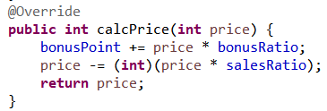

# 객체간의 상속
## 클래스 상속
- 이미 구현된 클래스보다 더 구체적인 기능을 가진 클래스를 구현할 때 상속한다!
- 일반적인 범주의 상위 클래스를 가지고, 그것의 하위 클래스를 생성하고자 할때 사용한다.
- ex) 동물 -> 강아지, 고양이, 사람
- 상속의 개념도
- 상속의 문법
  - class B extends A{ }
 

   

- 하위 클래스가 상위 클래스의 속성과 기능을 확장(extends)한다고 생각하면 된다!!

### **주의할 점!!**
- 상속은 클래스간의 결합도를 높이는 설계이다.
- 상위 클래스의 수정이 많은 하위 클래스들에 영향을 미칠 수 있다.
- 계층구조가 복잡하면 구현 및 수정에 좋지 않다.
- **편리한 기능이지만!!! 신중히 사용해야 한다!!**

   

## 형 변환(업캐스팅)
- 상위 클래스로 변수를 선언하고 하위 클래스의 생성자로 인스터스를 생성한다.
- 하위 클래스는 상위 클래스의 타입을 내포하고 있으므로, 상위 클래스로의 묵시적 형 변환이 가능하다!! (**역은 성립하지 않음**)
   

## 메서드 재정의(overriding)
- 오버라이딩(overriding) : 상위 클래스에 정의된 메서드의 구현 내용을 하위 클래스에서 동일한 이름으로 재정의 할 수 있다!
- 하위 클래스에서 특정 메서드의 기능이 일부 달라지거나 할 때 사용할 수 있다.
  
  
