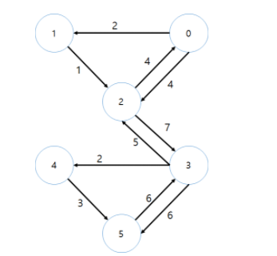

# 자바와 자료구조2
## **자료구조의 종류**
- 어제 정리했던 선형구조에 이어서 선형이 아닌 자료구조에 대해서 추가적으로 정리해보려 한다!
- 트리(Tree) : 부모 노드와 자식 노드간의 연결로 이루어진 자료구조를 말한다.
  - 이진 검색 트리(binary search tree)
    - 자료값의 중복을 허용하지 않는다.
    - 부모 노드보다 작은 값은 왼쪽 자식노드, 큰 값은 오른쪽 자식노드로 간다.
    - 자료 검색에 걸리는 평균 시간이 짧으며, inorder traversal 탐색을 통해 정렬된 자료를 출력할 수 있다. 
      

- 그래프(Graph) : 정점과 간선들의 유한 집합
  - 정점(vertex) : 여러 특성을 가지는 객체, 노드(node)
  - 간선(edge) : 이 객체들의 연결관계, 링크(link)
  - 그래프를 구현하는 방법 : 인접 행렬, 인접리스트
  - 그래프를 탐색하는 방법 : BFS(bread first search), DFS(depth first search) 
     

- 해싱(Hashing) : 자료를 검색하기 위한 자료 구조
  - 검색을 위한 자료구조
  - 키(key)에 대한 자료를 검색하기 위한 사전(dictionary) 개념의 자료구조
  - key는 유일하고 이에 대한 value를 쌍으로 저장
  - index = h(key) : 해시 함수가 key에 대한 인덱스를 반환해주고, 해당 인데스 위치에 자료를 저장
  - 다음의 구조를 참고해보자! 
     
      

